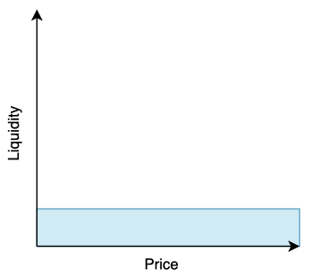
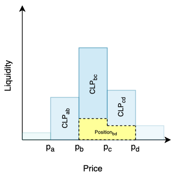

# Ergo DEX - An Automatic Decentralized Exchange

## Table of contents
1. Introduction
2. Protocol architecture overview
   1. Order-Book
   2. AMM
3. Tokenomics

## Introduction

Act of exchange without trusted parties is a most basic primitive for decentralized finance on top of blockchains. Many types of contracts for that were introduced early: with partial filling, buyback guarantee and so on. What is good for traders in decentralized worlds, such contracts are usually composable. While swap order contracts allows for orderbook-based decentralized exchanges (DEXes), now popular AMM-based DEXes (where AMM stands for Automated Market Maker) are also possible on blockchains with advanced smart-contracts such as Ergo and Cardano. Interestingly, unlike other known blockchains, thanks to the eUTXO model, liquidity pool contracts for AMM-based DEXes can be combined with order contracts (for orderbook-based DEXes). This gives unique possibility to have shared liquidity among different types of exchanges on top of the Ergo and Cardano blockchains.

This document provides a description of the Automated Decentralized Exchange protocol on top of Ergo and Cardano.

## Protocol architecture overview

### Order-book DEX

Orders are waiting for other orders to be matched, or for a cancellation. There are the following three types of orders — "buy" (i.e. buy tokens for native asset), "sell" (i.e. sell tokens for native asset), and "swap" (buy tokens for other tokens) orders. Order-book DEX has the advantage of working best for those pairs with high liquidity.

#### Atomic limit orders

Atomic orders can only be executed completely and are otherwise refunded. Such orders can either be aggregated by the ErgoDEX client so that users can choose from them or matched in an order-book with partial orders which will be defined next.

#### Partial limit orders

Partial orders are something more familiar to those who've ever used classical CEX'es. These orders can be partially executed so the best way to work with them is an order-book, where they can be aggregated, matched and executed by ErgoDEX bots.

### AMM DEX

Unlike order-book based DEX which relies on an order-book to represent liquidity and determine prices AMM DEX uses an automated market maker mechanism to provide instant feedback on rates and slippage. AMM DEX suits best for pairs with low liquidity.

Each AMM liquidity pool is a trading venue for a pair of assets. In order to facilitate trades a liquidity pool accepts deposits of underlying assets proportional to their price rates. Whenever deposit happens a proportional amount of unique tokens known as liquidity tokens is minted. Minted liquidity tokens are distributed among liquidity providers proportional to their deposits. Liquidity providers can later exchange their liquidity tokens share for a proportional amount of underlying reserves.

#### Constant Function Market Makers (CFMM, classical AMM pools)

Classical AMM pools are based on Constant Product formula which is `x*y=c`, where `x` and `y` are deposits on tokens X and Y respectively and `c` is their product which has to remain constant after swap operations. CFMMs provide liquidity across the entire price range.

#### Concentrated AMM pools

While in CFMMs liquidity is uniformly distributed along the reserve curve, which is slightly inefficient as much of the reserves held in a pool are never used, Concentrated AMMs allow LPs to provide liquidity to smaller price ranges. Each pair is composed of smaller pools each corresponding to some price range. We call such pool a concentrated liquidity pool (CLP). A CLP only needs to maintain enough reserves to support trading within its range, and therefore can act like a constant product pool with larger reserves (we call these the virtual reserves) within that range. At the same time LPs are not bound to some particular CLP and price range and can provide liquidity to multiple adjacent CLPs therefore forming something what we call a position. While price of an asset is within a position's price range the position is earning protocol fees. When the price escapes the position's price range it's liquidity no longer earns fees as it's not active anymore.

## Tokenomics

In the ErgoDEX each actor is incentivized to fulfill his role as best as possible.

There are four types of economic agents in the ErgoDEX ecosystem:

* Miners - need to be incentivized in order to process transactions
* DEXes (Parties which run DEX bots and UI) - need to be incentivized in order to provide best services.
* Liquidity providers (LPs) - need to be incentivized in order to provide liquidity.
* Traders

Each type of agents benefits from using DEX in his own way:

* Miners are earning miner fees paid in ERGs
* DEXes are earning fees paid in ERGs from both OrderBook and AMM services
  * In AMM: fees are charged for every operation on a liquidity pool
    * An amount of native tokens defined by a user for deposit|redeem operations
    * An amount of native tokens defined by a user for each unit of quote asset exchanged
  * In OrderBook: fees are charged in native tokens for each unit of quote asset exchanged
* LPs benefit from protocol fees paid in tokens and accumulated in liquidity pools
* Traders benefit from DEX services they use
